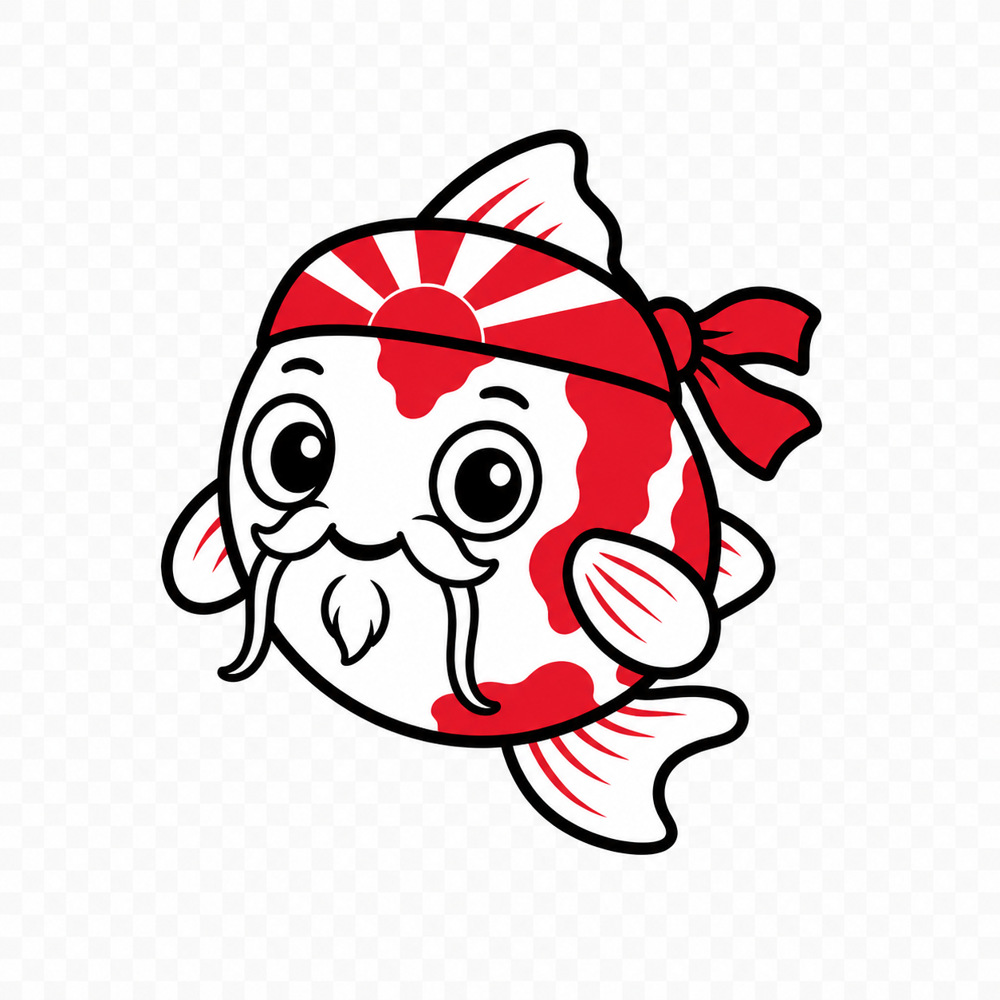

<p align="center">
  
</p>

<h1 align="center">Sensei</h1>

<p align="center"><strong>Architectural memory for AI coding agents.</strong><br>
<em>Make your agent aware of the repository before it changes it.</em></p>

<p align="center">
  <a href="https://github.com/globulario/sensei/actions/workflows/ci.yml"></a>
  <a href="LICENSE"></a>
  <a href="go.mod"></a>
  
</p>

Your AI agent writes code well but can't see your architecture — the rules that
live in a senior engineer's head and in commit archaeology. Sensei makes that
knowledge a **local, queryable graph** your agent consults through **MCP**, so
before it edits a file it already knows:

- the **invariants** that govern it
- the **failures** that happened there before
- the **fixes it must not attempt**
- the **tests** that prove the architecture still holds

Local. Open source. Repository-owned. Works with **Claude Code, Cursor, Codex,
and any MCP-compatible agent** — and gates pull requests in **CI**.

## What changes when Sensei exists

**Without Sensei** — the agent makes a locally correct change that is the exact
shape of last quarter's incident:

> **Agent:** "I'll set `paid = true` when the callback arrives."

**With Sensei** — the agent asks for a briefing first and gets:

```
CRITICAL  payments.paid_state_requires_processor_confirmation
  "paid" is money truth — it must come from the processor's confirmation,
  never from a local cache or callback payload.

Forbidden fix:  trusting the local callback payload
Required test:  TestPaidStateRequiresVerifiedConfirmation
```

> **Agent:** "I need to verify the processor's confirmation before changing state."

---

## Install (about 3 minutes)

Linux or macOS, **Go 1.25+**. Oxigraph (the local store) is fetched for you — no Docker.

```bash
git clone https://github.com/globulario/sensei.git
cd sensei
./scripts/install.sh                 # builds sensei + server + MCP bridge, fetches oxigraph → bin/
export PATH="$PWD/bin:$PATH"
```

The installer ends by printing the exact MCP config to hand your agent. Keep it —
you'll paste it in the next step.

> Kick the tires first (optional): `sensei demo` stands up the whole stack on
> throwaway ports and returns one real briefing, then cleans up.

## Make your agent repo-aware (the core workflow)

Everything below is something you say to your coding agent. Sensei does the work;
the agent drives it and then benefits from it.

**1. Give the agent the Sensei tools.** Add the MCP server the installer printed
to your client config (Claude Code: `.mcp.json` at the repo root):

```json
{
  "mcpServers": {
    "sensei": {
      "command": "/absolute/path/to/bin/awareness-mcp",
      "args": ["--awareness-addr", "localhost:10120"]
    }
  }
}
```

Then, in your agent:

> **You:** "Is the Sensei MCP available? List the `mcp__sensei__*` tools."

The agent should see `awareness_briefing`, `awareness_impact`, `awareness_preflight`,
`awareness_edit_check`, `awareness_resolve`, `awareness_query`, `awareness_metadata`.

**2. Bootstrap the repository's awareness graph.**

> **You:** "Bootstrap this repo with Sensei, then start the server."

```bash
sensei bootstrap --repo .      # extract architecture (contracts, components, symbols, tests) → docs/awareness/
sensei serve -no-seed &        # start the local store + server on :10120 (your graph only)
sensei build                   # compile docs/awareness/ into the running graph
```

**3. Ask the agent to evaluate the repository.** Now the agent can reason about
the repo *from the graph*, not just the files it happened to read:

> **You:** "Run a Sensei repo evaluation and summarize the risks."

```bash
sensei repo-eval               # architecture + awareness quality: is this repo ready for controlled agent work?
```

**4. Ask it to audit the awareness graph itself** — drift, gaps, dangling rules:

```bash
sensei audit                   # self-audit: what's stale, uncovered, or inconsistent
```

**5. From now on, the agent consults before it edits.** With the MCP tools wired,
your agent calls `awareness_briefing` before touching a file and gets the rules,
forbidden fixes, and required tests that apply — in about two milliseconds. Add
the generated hooks (`sensei init` writes them) to *enforce* consult-then-comply
rather than rely on the agent's good behavior.

## CI: gate every pull request

Make the same knowledge block architecture-violating PRs before merge. The action
installs Sensei, fetches Oxigraph and runs the server for you, evaluates the diff,
and writes a summary into the job — so the consuming workflow is one `uses:` line:

```yaml
# .github/workflows/sensei.yml  (full example: docs/ci/sensei-gate.yml)
name: Sensei architectural review
on: [pull_request]
permissions:
  contents: read
  security-events: write     # so findings appear in Security → Code scanning
jobs:
  review:
    runs-on: ubuntu-latest
    steps:
      - uses: actions/checkout@v4
        with: { fetch-depth: 0 }
      - uses: globulario/sensei-action@v1
        with:
          mode: advisory          # advisory (report, never blocks) | enforce (fail on a violation)
```

`enforce` mode exits non-zero on a blocking finding and **fails closed** if it
can't verify the diff. Per-repo policy (`.sensei/gate-policy.yaml`) can re-level
or silence any rule without a code change. The action posts a Markdown summary to
the GitHub **job summary** each run.

## What the agent gets before an edit

`awareness_briefing` (or `sensei briefing --file <path>`) returns exactly what an
agent needs to change a file safely:

- **Invariants** — the rules that govern the file, with severity
- **Forbidden fixes** — tempting changes that reintroduce known bugs
- **Failure modes** — what went wrong here before, and the real fix
- **Required tests** — the proof the architecture still holds
- **Authority** — whether the graph itself is current and trustworthy

Other surfaces for other moments: `impact` (structured nodes), `preflight` (risk
before a task), `edit-check` (does *this* proposed content violate a rule),
`propose` (record a new scar the agent just learned).

## Adopt it as a staircase, not a cliff

| Level | You do | You get |
|---|---|---|
| **1 — One invariant** | protect one dangerous file | briefings on that file |
| **2 — One scar** | record an incident + its forbidden fixes | that bug can't return the same way |
| **3 — Agent consults** | wire the MCP tools + hooks | agents look before they edit |
| **4 — CI governance** | add the [gate action](#ci-gate-every-pull-request) | dangerous diffs blocked before merge |
| **5 — Architectural graph** | `sensei bootstrap` | inferred contracts, dependencies, symbols, coverage |

## Who is this for?

Sensei earns its place when:

- senior engineers keep repeating the same architecture warnings
- AI agents make locally correct but globally dangerous changes
- important rules live in Slack, post-mortems, and memory
- regressions repeat after team turnover
- code review depends on one or two people who know the history
- onboarding is months of repository archaeology

## What Sensei is (and isn't)

Sensei is **governed architectural memory for a software repository.**

| Sensei is **not** | Sensei **is** |
|---|---|
| another code-generation model | repository-owned architectural knowledge |
| a generic doc-search / RAG tool | queried *before* changes, at edit time |
| a linter with hard-coded rules | connected to files, incidents, forbidden fixes, tests |
| a hosted knowledge base | local, versioned with your code |
| a replacement for tests or review | usable by any agent, enforceable in CI |

## The meta-principles: rules you haven't written yet

Your project's invariants and scars tell Sensei **what must remain true here.**
The meta-principles help Sensei discover **where architectural danger tends to
hide.** Every project ships with **133 universal principles across 8 categories**,
distilled from real production incidents and portable to any system:

| Category | Count | Examples |
|---|---|---|
| **Authority** | 20 | wrong actor writes truth; one value, two meanings |
| **Signal** | 19 | a fallback that looks like truth; errors absorbed into timeouts |
| **Lifecycle** | 38 | a write with no cleanup; intermediate state that looks done |
| **Dependency** | 7 | critical path blocked by a non-critical service |
| **Perception** | 19 | a green badge lying about runtime state |
| **Composition** | 7 | success color on unconfirmed state |
| **Structure** | 12 | a "shared" component whose consumers import its internals |
| **Evolution** | 11 | releasable trunk; reviewable slices; deterministic builds |

Reference: **[docs/meta-principles.md](docs/meta-principles.md)**. Query one:
`sensei resolve invariant meta.<id>`.

## A real-world origin

Sensei was born in **[Globular](https://github.com/globulario)** — a 465K-line
distributed platform with 33 services, built with AI agents doing significant
implementation work. They were productive but kept reintroducing the same class
of architectural failure (authority confusion, stale state presented as truth,
recovery paths that depend on what they must recover, fixes that violate ownership
boundaries). Those 50+ incidents became queryable invariants, failure modes,
forbidden fixes, and required tests — and the recurring shapes became the 133
portable meta-principles that ship with every `sensei init`. Sensei now runs
entirely on its own, for any codebase.

---

## Command reference

The **[full CLI reference](docs/cli-reference.md)** documents every command and flag.

| Command | What it does |
|---|---|
| `sensei bootstrap --repo .` | Extract a repo's architecture into `docs/awareness/` |
| `sensei init` | Scaffold a project (YAML templates, agent hooks, CLAUDE.md) |
| `sensei serve` | Start Oxigraph + the gRPC server |
| `sensei build` | Compile `docs/awareness/` into the store |
| `sensei repo-eval` | Evaluate architecture + awareness quality |
| `sensei audit` | Self-audit the graph for drift, gaps, inconsistencies |
| `sensei briefing --file <p>` / `--task "…"` | Context for a file or task |
| `sensei impact` / `preflight` / `edit-check` | Nodes / risk / advisory edit check |
| `sensei gate --diff <range> --mode enforce` | Gate a git diff in CI |
| `sensei propose --kind …` | Record a scar (typed feedback); stage — never commits |
| `sensei check` / `validate` | Validate YAML sources / deep structural check |
| `sensei demo` | Stand up a graph and return one briefing — one command |

## Agent integration (MCP + hooks)

The MCP bridge exposes seven stdio tools (`awareness_briefing`, `awareness_impact`,
`awareness_preflight`, `awareness_edit_check`, `awareness_resolve`,
`awareness_query`, `awareness_metadata`):

```bash
go run ./cmd/awareness-mcp -awareness-addr localhost:10120
```

`sensei init` also generates Claude Code hooks that *enforce* consult-then-comply:
`enforce-briefing.sh` (did you *look*?), `edit-check-guard.sh` (does what you're
about to *write* violate a rule?), `record-briefing.sh`. Wire them in
`.claude/settings.json` — see **[QUICKSTART.md](QUICKSTART.md)** and
**[docs/api-reference.md](docs/api-reference.md)**.

## Architecture

```
docs/awareness/*.yaml  ──sensei build──▶  Oxigraph (RDF store)  ──gRPC──▶  sensei serve ──▶  MCP bridge ──▶  your agent
       (extracted)        (yaml2nt)                                            │
                            sensei briefing / impact / preflight / edit-check / gate
```

Sensei compiles YAML into RDF triples, stores them in Oxigraph (a single-binary
SPARQL store — no JVM, no cluster), and serves them over gRPC. The CLI and the MCP
bridge are thin clients. **No arbitrary SPARQL is exposed** — every query mode is
a closed whitelist.

<details>
<summary><strong>Repo layout · building from source · running inside Globular</strong></summary>

```
cmd/awg/               standalone CLI (bootstrap, init, build, serve, briefing, gate, demo, …)
cmd/awareness-mcp/     MCP bridge (stdio)
cmd/yaml2nt/           YAML → N-Triples compiler
golang/server/         gRPC service handlers (embeds the self seed)
golang/extractor/      extraction + validators + structural scanners
proto/  ontology/      gRPC contract · RDF vocabulary (source of truth)
docs/                  cli-reference · api-reference · agent-usage · meta-principles
```

```bash
go build ./...                 # everything
make sensei                    # CLI + server together
make sensei-smoke              # end-to-end smoke test
go test ./...                  # tests
```

Prerequisites: **Go 1.25+** (protoc optional). Sensei also runs as a native
Globular gRPC service (etcd registration, cluster mTLS, `make service-package`);
none of it is required for standalone use.
</details>

## License

Apache License, Version 2.0 — see [LICENSE](LICENSE) and [NOTICE](NOTICE). Covers
the whole local runtime (CLI, server, MCP bridge, extractors, the gate, the VS
Code extension). Use, modify, and redistribute — including commercially.
